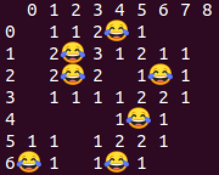
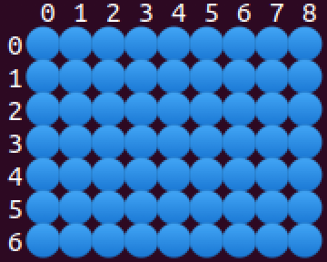
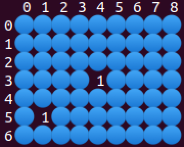
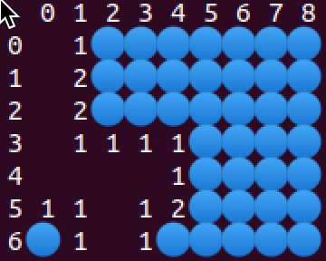
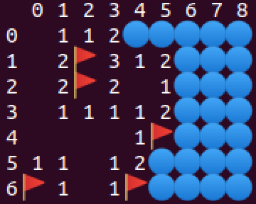

**CMSI 284** Computer System Organization/Systems Programming, Spring 2020

# Mine-C-Weeper
The centerpiece portion of this assignment centers on a C implementation of the [Minesweeper](https://en.wikipedia.org/wiki/Minesweeper_(video_game)) game. Thus, as you might expect, we are calling it “Mine-**C**-Weeper.” Instead of looking for mines, we’ll be looking for joyful “weepers,” as represented by the 😂 emoji.

## What to Do
Writing the entire game from scratch is still a notch above our level, so instead, as with “Oh Say Can You C,” the game’s implementation has been broken up into discrete functions that can be tested (mostly) separately. Test programs that call these functions and the overall game itself have already been written for you.

### What You are Given
To model code reuse, we’re bringing in some “friends” from the previous assignment. You don’t have to do anything new with them—just compile and call them properly, now that you know how to build C programs from multiple source files:

* `emit_utf_8` is declared in _io-utilities.h_ and implemented in _io-utilities.c_
* `is_non_negative_numeral` is declared in _string-plus.h_ and implemented in _string-plus.c_

Nearly all of the code that you will write should reside in _mine-c-weeper.c_, with “public” functions (and some key data structures) declared in _mine-c-weeper.h_.

Two major Mine-C-Weeper functions have been implemented for you. However, they do depend on your implementing some other functions before they will work correctly. These functions are the game initializers:

```c
mcw_game* initialize_random_game(int width, int height, int probability);
mcw_game* initialize_file_game(char* filename);
```

They are given to you because:
1. Everyone’s games can be created in a standard, consistent way (including the random version)
2. These functions require some C techniques that are not covered in class (though feel free to look at them and learn about them on your own)
3. The code in these functions will give you a starting point for how you would implement the other functions

Thus, do look at them even if they’re already done for you. Parts of these functions will show you how to accomplish certain operations that you might now know off the top of your head.

Test programs have been written for you, prefixed with numbers `01-` to `10-`, so that you can progressively write functions one at a time and check their correctness before moving on. Each successive test program will rely on more and more functions, culminating in your ability to compile the full _mine-c-weeper-game.c_ program in order to get a fully-functional Mine-C-Weeper game.

### Compilation Instructions
Given these files, compilation would occur as follows. For individual tests while work is in progress, the command would be:

    gcc string-plus.c io-utilities.c mine-c-weeper.c <test-file.c>

For the full game, the command would be:

    gcc string-plus.c io-utilities.c mine-c-weeper.c mine-c-weeper-game.c

### What You are Asked to Implement
As defined in _mine-c-weeper.h_, you are asked to implement the following functions. Definitions for their behavior are provided in comments within that file:

```c
void free_game(mcw_game* game);
void display_game_field(mcw_game* game);
void show_all(mcw_game* game);
int get_weeper_count(mcw_game* game);
int get_flag_count(mcw_game* game);
int get_adjacent_weeper_count(mcw_game* game, int x, int y);
void display_game_state(mcw_game* game);
bool is_in_game_bounds(mcw_game* game, int x, int y);
void mark_game_square(mcw_game* game, int x, int y);
void reveal_game_square(mcw_game* game, int x, int y);
bool is_game_over_loss(mcw_game* game);
bool is_game_over_win(mcw_game* game);
```

A couple of functions are also required that are “private” to _mine-c-weeper.c_ but are called by the already-given game initialization functions:

```c
mcw_game* alloc_game(int width, int height);
void hide_all(mcw_game* game);
```

The definitions for these functions are included in the _mine-c-weeper.c_ file.

### Implementation Sequence
You will want to implement the following functions first and foremost, because they are required by the game initialization functions and early test programs:

```c
mcw_game* alloc_game(int width, int height);
void free_game(mcw_game* game);
void hide_all(mcw_game* game);
```

Immediately after these, you will then want to write the display functions so that you can visually see what’s on the game boards that you create:

```c
void display_game_field(mcw_game* game);
void display_game_state(mcw_game* game);
```

After that, it’s mostly your choice; additional guidance can be seen in the way the test programs are numbered. If you generally follow that sequence, you should be able to work your way incrementally through the implementations without the pressure of needing to implement absolutely everything before you see some satisfying results.

### Implementation Difficulty
Despite the large number of functions, many of them should be fairly easy—they reflect the kinds of functions that you have already written so far (but perhaps just not in C). The ones that will likely be new to you are:

```c
mcw_game* alloc_game(int width, int height);
void free_game(mcw_game* game);
```

Yes they are the first ones you should write, but they aren’t _long_ per se (they are 36 non-blank lines _total_ in my version, including lines with a single `}`). The main trick with these is that you will need to:
* Understand how to use `malloc` and `free`
* Figure how to allocate memory for C structures and two-dimensional arrays

`malloc` and `free` have already been discussed both in class and on async videos. An additional async video will be made available that will walk through the latter.

The most challenging functions in _mine-c-weeper.c_ are:

```c
int get_adjacent_weeper_count(mcw_game* game, int x, int y);
void reveal_game_square(mcw_game* game, int x, int y);
```

However, the challenge here isn’t because of C—these functions pose the same degree of difficulty on any language. They do require some thought—especially `reveal_game_square`. Find ways to implement them partially at first, check if they work, then progress slowly toward full functionality.

### Game File Format
To facilitate the creation of custom-designed as well as reproducible game boards, an _.mcw_ file format has been defined that can be read by `initialize_file_game`. An _.mcw_ file is a text file with the following contents:
1. The first line includes the width and height of the board, separated by a space
2. All succeeding lines consist if _width_ characters indicating of the content of each square
    * A `.` indicates an open square
    * A `W` indicates a square that has a “weeper”
3. There should be a total of _height_ lines after the first one

For reference, a _test.mcw_ file is provided with this repository. Feel free to create other _.mcw_ files for your own testing and entertainment!

### Game Display Format
To get some consistency and playability, the `display_game_field` and `display_game_state` functions should adhere to a common format:
1. The `display_game_field` should ignore the `status` array of the game, showing the `field` contents exactly as they are
2. The `display_game_state` should factor in the `status` array, hiding squares if hidden and showing the underlying `field` content only if that square has been revealed; marks/flags should also appear in `display_game_state`
3. Code points are provided for the characters indicating `HIDDEN`, `WEEPER`, and `MARKER` squares in _mine-c-weeper.h_
4. Both displays should show coordinate guides at the top and left of the game display, to help users with determining the coordinates of the square
5. Both displays should (eventually) show the number of weepers adjacent to each square, per game rules; when the number of adjacent weepers is zero, spaces should be displayed

By convention, emoji glyphs like the ones used for `HIDDEN`, `WEEPER`, and `MARKER` are _twice as wide_ as standard glyphs such as spaces and numbers. Take this into account in order to get a readable, tabular display.

Taking all of these specifications into account, samples of `display_game_field` and `display_game_state` are given below. For ease of reference, the two displays are based on the _test.mcw_ file that is provided with this repository.

#### `display_game_field` Sample
Note that the displayed game may have hidden or marked squares—it’s just that they are completely ignored by `display_game_field`.



#### `display_game_state` Samples
Unlike `display_game_field`, the `display_game_state` function _should_ factor in hidden or marked squares. Multiple samples are thus provided, showing a sample game in different states of progress.

* Completely hidden



* A few squares revealed



* Multiple squares revealed



* Marked squares



## Specific Point Allocations
This portion of the assignment is scored according to outcomes _2b_, _3a_, _4a_, _4b_, and _4d_ in the [syllabus](https://dondi.lmu.build/spring2020/cmsi284/cmsi284-spring2020-syllabus.pdf). For this particular portion, graded categories are as follows:

| Category | Points | Outcomes |
| -------- | -----: | -------- |
| All programs compile and run without unexpected errors | 10 | _3a_, _4a_, _4d_ |
| Game memory allocation is precise—no shotgun approach | 20 | _2b_, _4a_, _4d_ |
| Game memory is freed correctly | 20 | _2b_, _4a_, _4d_ |
| Implemented functions produce correct results and behaviors | 40 | _2b_, _4a_, _4d_ |
| Complete game is playable | 10 | _2b_, _4a_, _4d_ |
| Failure to write functions as defined | deduction only | _4b_ |
| **Total** | **100** |

Note that inability to compile and run to begin with will negatively affect the correctness of program output and proper handling of invalid user input.
